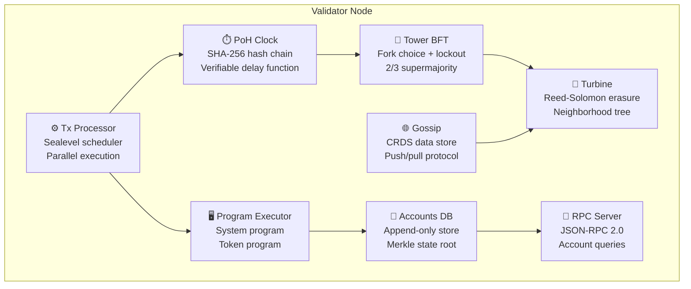

# ⛓️ TrustNode

<a class="tests-cta" href="./tests">🧪 View test results — 110/110 →</a>

**A custom Solana-like validator built from scratch in Rust** — PoH clock,
Tower BFT consensus, Sealevel parallel execution, Turbine block propagation
with Reed-Solomon erasure coding, CRDS gossip protocol, and a SBF-inspired
program executor.

> *Not a wrapper. Not a fork. Every line written from scratch to understand
> how Solana actually works.*

> **Project status:** educational/research implementation — 110 tests, all green,
> full CI/CD pipeline.

---

## 🎯 What it does

| Component | What It Does | Inspired By |
|---|---|---|
| **PoH Clock** | SHA-256 hash chain creates a verifiable clock — proves time has passed without trusting a timestamp server | Solana PoH |
| **Tower BFT** | PoH-based BFT consensus with lockout-based fork switching — 2/3 supermajority for finality | Solana Tower BFT |
| **Sealevel Scheduler** | Groups non-conflicting transactions into parallel batches — read-only accounts shared, write-locked serialized | Solana Sealevel |
| **Program Executor** | Dispatches instructions to System/Token programs — full SOL transfers, account creation, token operations | Solana SBF/EBPF |
| **Accounts DB** | Append-only storage with DashMap index + Merkle state root — O(1) lookups, verifiable state | Solana AccountsDB |
| **Turbine** | Reed-Solomon erasure coding splits blocks into shreds — any k-of-n shreds reconstruct the block | Solana Turbine |
| **Gossip** | CRDS (Cluster Replicated Data Store) for node communication — push messages, pull requests, ping/pong | Solana CRDS |
| **RPC Server** | JSON-RPC 2.0 API — getAccountInfo, getBalance, getSlot, getHealth, sendTransaction (real execution via the tx-processor), getTransaction (status/logs by signature) | Solana JSON-RPC |

## ⚙️ Architecture



## 🚀 Quick start

```bash
# Build
git clone https://github.com/BartoszOsiej/solana-validator.git
cd solana-validator
cargo build --release

# Run validator (with block production)
./target/release/solana-validator --mining

# Run with RPC on custom port
./target/release/solana-validator --rpc-port 9000 --gossip-port 8001

# Run benchmarks
./target/release/solana-validator --bench
```

## 📁 Workspace Structure

```
solana-validator/
├── crates/
│   ├── poh/                    # Proof of History clock
│   ├── accounts/               # State storage
│   ├── tx-processor/           # Transaction execution
│   ├── consensus/              # Tower BFT
│   ├── turbine/                # Block propagation
│   ├── gossip/                 # Node communication
│   ├── program-executor/       # Instruction VM
│   └── rpc/                    # JSON-RPC API
└── validator/
    └── src/main.rs             # Validator binary
```

## ⚡ Benchmarks

Measured on Linux x86_64:

| Benchmark | Result |
|---|---|
| **PoH throughput** | ~1M hashes/sec (SHA-256) |
| **Accounts DB insert** | 10K accounts in &lt;50ms |
| **State root computation** | 1K accounts in &lt;1ms |
| **Erasure coding** | 100 encode/decode cycles |
| **Transaction execution** | 10K txs/sec |
| **Slot time** | ~400ms (configurable) |

## 🧪 Test Results

```
test result: ok. 17 passed; 0 failed   (solana-poh)
test result: ok. 15 passed; 0 failed   (solana-accounts)
test result: ok. 12 passed; 0 failed   (solana-tx-processor)
test result: ok. 17 passed; 0 failed   (solana-consensus)
test result: ok. 16 passed; 0 failed   (solana-turbine)
test result: ok. 10 passed; 0 failed   (solana-gossip)
test result: ok.  6 passed; 0 failed   (solana-rpc)
test result: ok. 17 passed; 0 failed   (solana-program-executor)
─────────────────────────────────────
           110 passed; 0 failed
```

## 📡 RPC API

```bash
# Health check
curl -X POST http://127.0.0.1:8899 -d '{"jsonrpc":"2.0","method":"getHealth","id":1}'

# Get version
curl -X POST http://127.0.0.1:8899 -d '{"jsonrpc":"2.0","method":"getVersion","id":1}'

# Get slot
curl -X POST http://127.0.0.1:8899 -d '{"jsonrpc":"2.0","method":"getSlot","id":1}'

# Get account info
curl -X POST http://127.0.0.1:8899 -d '{"jsonrpc":"2.0","method":"getAccountInfo","params":["<pubkey>"],"id":1}'

# Get balance
curl -X POST http://127.0.0.1:8899 -d '{"jsonrpc":"2.0","method":"getBalance","params":["<pubkey>"],"id":1}'
```

## 🧠 How PoH Works

```
genesis_hash → SHA256 → SHA256 → SHA256 → ... → slot_hash
                ↓          ↓         ↓
              tick       tick      tick
            (6000      (6000     (6000
            hashes)    hashes)   hashes)
```

Each tick proves that `N` sequential hash computations occurred. Transactions
are interleaved between ticks, creating a verifiable temporal ordering.

**Verification**: To verify an entry, you re-hash from the previous hash N times
and check the result matches. No trust required.

## ⚠️ Disclaimer

This is an educational implementation — not a production validator. It demonstrates
the core concepts of Solana's architecture but lacks many production features
(networking, persistence, BLS signatures, snapshot loading, etc.).

**Do not use this for real transactions or staking.**

## 🔗 Links

- [GitHub](https://github.com/BartoszOsiej/solana-validator)
- [Solana Whitepaper](https://solana.com/solana-whitepaper.pdf)
