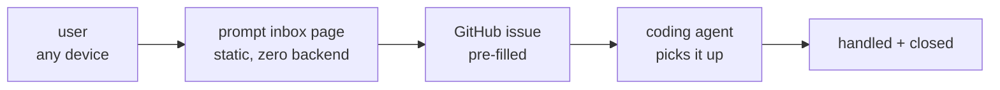

# 🎯 Promptbox (/docs/projects/prompt-inbox)


# 🎯 Promptbox [#-promptbox]

**Remote prompt inbox for the coding agent.**

Send a prompt from anywhere — it lands as a GitHub issue — the agent handles it.

> **Project status:** production-ready, zero backend, mobile-first, published on npm.

***

## 🎯 What it does [#-what-it-does]

| Capability             | Description                                  |
| ---------------------- | -------------------------------------------- |
| **Zero backend**       | Static HTML page, no server, no database     |
| **GitHub integration** | Pre-fills `issues/new?title=…&body=…`        |
| **Mobile-first**       | Works on any device with a browser           |
| **Agent workflow**     | Coding agent picks up issues and closes them |
| **Multi-project**      | Supports multiple project targets            |

## ⚙️ How it works [#️-how-it-works]



1. Open [bartoszosiej.github.io/prompt-inbox](https://bartoszosiej.github.io/prompt-inbox/)
2. Pick a project, type a prompt, hit **Submit**
3. A pre-filled GitHub issue opens in the browser
4. The coding agent picks it up, handles it, and closes the issue

## 🚀 Quick start [#-quick-start]

```bash
# Local dev
python3 -m http.server 8080

# Docker
docker build -t ghcr.io/bartoszosiej/prompt-inbox:latest .
docker run -p 8080:80 ghcr.io/bartoszosiej/prompt-inbox:latest

# npm
npx prompt-inbox
```

## 📖 Usage [#-usage]

### For users [#for-users]

1. Open the prompt inbox page
2. Select target project from dropdown
3. Type your prompt
4. Click Submit → GitHub issue opens
5. Agent handles it

### For agents [#for-agents]

When the user says "check the inbox":

1. Read open issues from `https://api.github.com/repos/BartoszOsiej/Promptbox/issues?state=open`
2. Each issue has: title `[Project] summary`, body with the prompt
3. Handle the prompt in the relevant project repo
4. Close the issue
5. Reply to the user with what was done

## 🔗 Links [#-links]

* [GitHub](https://github.com/BartoszOsiej/Promptbox)
* [npm](https://www.npmjs.com/package/prompt-inbox)
* [Live](https://bartoszosiej.github.io/prompt-inbox/)
* [GHCR](https://github.com/BartoszOsiej/Promptbox/pkgs/container/prompt-inbox)
